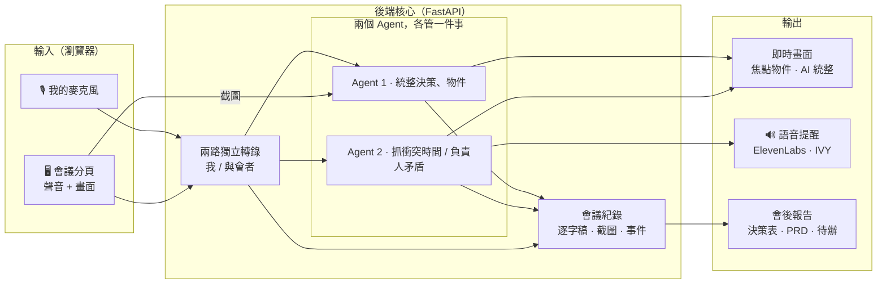

# AIMEET 艾咪 — 會議脈絡驗證 Agent

> 艾咪不是取代你的會議工具，而是驗證會議中發生的事情。

---

## 摘要與背景

> **54%** 的人離開會議時，仍不知道下一步是什麼，或任務到底由誰負責。  
> — *Atlassian, 2024*

> **93%** 的「哪一個／在哪裡」回答都伴隨著指向手勢——但今天的會議紀錄，只記得你說了什麼。  
> — *University of Chicago, Frontiers in Communication*

AIMEET 將語音、手勢、視覺情境與會議記憶整合在一起，不只理解「說了什麼」，更理解「實際指的是什麼、誰要負責什麼」。  
當負責人、截止日期或決策內容與先前討論發生衝突時，AIMEET 會在錯誤被寫進待辦事項之前主動偵測並即時提醒。

---

## 為什麼需要 AIMEET？

### 核心痛點
1. **會議脈絡容易遺失**：像「這個交給 Amy」這類語句，傳統逐字稿無法辨識「這個」實際對應到畫面上的哪一個白板內容、架構物件或介面流程。
2. **決策衝突被直接記錄成錯誤待辦**：當負責人、截止日期或決策內容前後矛盾時，現有工具多半只負責被動記錄與摘要，缺乏會中的即時比對與驗證機制。

### 解決方案
1. **多模態脈絡綁定 (Visual Grounding)**：結合雙軌語音與伺服器端畫面時間對齊，精確解析「誰說了什麼、指了什麼、誰要負責什麼」。
2. **即時決策驗證 (Consistency Agent)**：主動偵測衝突，並透過語音與介面在錯誤成為定案前即時提醒。

---

## 使用場景與功能展示
 
**場景**：線上產品會議。主持人一邊分享畫面、一邊拿起實體原型講解陸續補充時程與分工。
 
Aimeet 掛在會議旁邊：
 
| 在會議裡… | Aimeet 當下… |
|---|---|
| 拿出一顆白綠色小球說：「這個……我們最新的產品，寶寶球」 | 從鏡頭畫面即時認出手上拿的實體物體，自動**截圖 + 辨識特徵 + 綁定上下文**，在左側生成一張「01 · 會議焦點物件」卡（`鏡頭前方、左手拿著的白綠色小圓形物件`）。 |
| 先說「原型主要由 **Ivy** 負責，星期五以前交最終定稿」；會議尾聲又說「提醒一下 **Jack**，寶寶球最終定稿星期五以前交給我」 | 立即抓到前後負責人矛盾，啟動 AI 語音助理 IVY 即時插話提醒：<br>「**嗯，提醒一下，寶寶球原型定稿剛才是 Ivy 負責，現在聽到的是 Jack。要不要確認一下最後由誰負責？**」 |
| 立刻反應澄清說：「**喔抱歉！是 Ivy，剛剛口誤了**」 | 理解發言者的口誤修正，自動確認最終責任歸屬，不產生誤判與干擾。 |
| 會議進行與結束（點擊「**產生報告**」） | 將會議中的視覺實體焦點（寶寶球截圖與脈絡）、負責人決策修正歷程（Ivy / Jack）、逐字稿一併結構化彙整為正式會議結論、待辦事項與報告。 |

## 系統架構


## 使用技術

| 類型 | 技術／服務 | 用途 |
| --- | --- | --- |
| AI 模型 | OpenAI `gpt-4o-mini-transcribe` | 即時語音轉錄 (STT)，原生繁體中文識別與低錯誤率 |
| AI 模型 | OpenAI `gpt-5.4-mini` (Responses API) | 會中即時推理、工具呼叫與視覺指涉判定 |
| AI 模型 | OpenAI `gpt-5.6-luna` | 會後多階段資訊萃取、覆蓋率檢查與報告合成 |
| AI 模型 | ElevenLabs (`eleven_v3` / IVY) | 會中即時口語衝突提醒語音合成 (TTS) |
| 前端 | Next.js 14, React, TypeScript, Tailwind CSS | 即時會議介面、音訊雙軌擷取 (`getUserMedia` / `getDisplayMedia`) |
| 後端 | Python 3.11+, FastAPI, WebSockets, uv | 雙軌音訊串流管理、回音過濾 (EchoFilter)、事件流持久化 |

---
## 安裝與執行
 
### 需求
- Windows 10/11（啟動腳本是 PowerShell；macOS / Linux 見下方手動啟動）
- Python 3.11+ 與 [uv](https://docs.astral.sh/uv/)
- Node.js 20+
- Chrome 或 Edge（需要 `getDisplayMedia` 分享畫面 + 分頁音訊）
- OpenAI API key（必要）；ElevenLabs API key（要語音提醒才需要）
 
### 安裝
 
```powershell
git clone https://github.com/Weiqd7779/Aimeet.git
cd Aimeet
cd api;  uv sync;  cd ..      # 依 uv.lock 建立 .venv
cd web;  npm ci;   cd ..      # 依 package-lock.json 安裝
Copy-Item .env.example api\.env
```
### 編輯 api\.env
```ini
OPENAI_API_KEY=sk-...
MOCK_MODE=false
LIVE_PROVIDER=openai
ELEVENLABS_API_KEY=sk_...     # 可留空：提醒卡片照出，只是不出聲
```
### 執行
```powershell
.\dev.ps1          # 啟動 / 重啟：清掉舊程序後開兩個視窗 → API :8000、Web :3000
.\dev.ps1 -Stop    # 全部停掉
```
打開 http://localhost:3000 → 開始會議 → 選要分享的分頁（勾「分享分頁音訊」）→ 允許麥克風。 http://localhost:8000/health 應回 {"status":"ok","live_provider":"openai"}。


## 作品展示

- 作品展示網址（選填）：
- 評選影片：https://youtu.be/27ZzpMc-uB0

## 限制與未來工作

| 面向 | 限制 | 現況處理 |
|---|---|---|
| 提醒延遲 | 從說出矛盾到聽見語音約 8–12 秒 | 可換 `eleven_flash_v2_5`（<1 秒）但失去語氣標記 |
| 衝突範圍 | 只抓「時間」與「負責人」兩種矛盾；金額、規格、範圍變更不在本版 | 帳本結構已預留 `task` 欄位可擴充 |
| 說話者 | 只有兩路：「我」與「與會者」。遠端多人會全部歸為「與會者」，無法分辨誰說的 | 兩路獨立轉錄保證「我 / 對方」不會錯 |
| 相對日期 | 「下星期三」換算成日期依會議當天推算，跨週／口誤時可能算錯 | 報告會把無法對回逐字稿的日期列進「不確定事項」 |
| 回音 | 開喇叭時與會者聲音漏回麥克風，靠文字相似度在 4 秒內去重，非聲學消除 | 建議 demo 戴耳機 |
| 平台 | 啟動腳本為 Windows PowerShell；macOS / Linux 需手動起 uvicorn 與 next | README 附手動指令 |
| 儲存 | 檔案系統落地，無資料庫、無使用者、無權限；多場會議只靠資料夾隔離 | 事實資料已使用結構化 json 儲存，可日後匯入資料庫 |

### 後續發展方向
1. **更多矛盾類型**：金額、數量、規格、範圍（「先做 A」→「先做 B」），以及跨會議的矛盾（今天說的和上週決議不同）
2. **說話者分離**：遠端多人時用聲紋或會議平台 API 取得參與者名稱，帳本的「人」就能對到真人
3. **持久化與多租戶**：record.json 匯入 Postgres + 向量索引，做跨會議搜尋與 RAG

## 第三方服務、資料與素材
 
### 外部服務（需自備帳號與金鑰）
 
| 服務 | 用途 | 連結 | 授權 / 條款 |
|---|---|---|---|
| OpenAI API — `gpt-4o-mini-transcribe` | 即時語音轉文字（兩路獨立） | https://platform.openai.com/docs/guides/realtime-transcription | [OpenAI Terms of Use](https://openai.com/policies/terms-of-use)、[Usage Policies](https://openai.com/policies/usage-policies)；按量計費 |
| OpenAI API — `gpt-5.4-mini` | 會中推理（決策、指涉、視覺定位） | https://platform.openai.com/docs/api-reference/responses | 同上 |
| OpenAI API — `gpt-5.6-luna` | 抓衝突判斷、會後報告整理 | 同上 | 同上 |
| OpenAI API — `gpt-4o-mini-tts` | 僅 e2e 測試：合成兩位模擬說話者 | https://platform.openai.com/docs/guides/text-to-speech | 同上 |
| ElevenLabs API — `eleven_v3` | 提醒語音合成 | https://elevenlabs.io/docs/api-reference/text-to-speech/convert | [ElevenLabs Terms of Service](https://elevenlabs.io/terms-of-use)；按字元計費 |
| ElevenLabs — 聲音「IVY」 | 提醒使用的聲音 | 帳號內 Instant Voice Clone | 由本專案成員以**本人聲音**建立，僅供本專案使用；不對外散布聲音模型 |
| Google Gemini API | 僅 STT A/B benchmark（`bench/`），主流程未使用 | https://ai.google.dev/gemini-api/docs | [Gemini API Terms](https://ai.google.dev/gemini-api/terms) |

，專案未使用任何外部圖片、音樂、資料集或第三方文字內容。

## 團隊成員

| 姓名 | 分工 |
| Mumu | 程式開發、撰寫文稿 |
| Ivy | 程式開發、製作簡報 |

## License

請在儲存庫根目錄加入明確的 `LICENSE` 檔案，並在此標示授權名稱。
